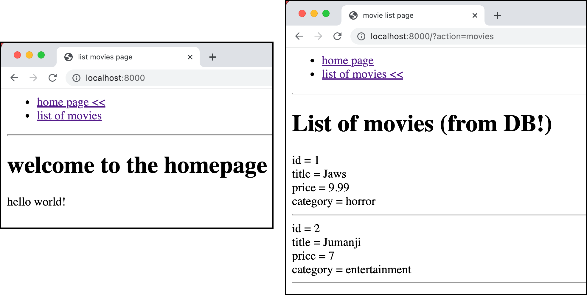

# pdo-crud-for-free-repositories-sample-project


This sample project illustrates how to use the PHP package:

- [pdo-crud-for-free-repositories](https://github.com/dr-matt-smith/pdo-crud-for-free-repositories)

    - visit that repository and look at the README to learn how to use the library ...

All code is (intended :-) to follow PSR-1, PSR-12 coding standards. Classes are following the PSR-4 autoloading standard.

## Install 1 - Get the files on your computer
Via Composer with the `create-project` option:

```bash
composer create-project organization/name-of-template name-for-new-project
```

Via Git clone:

``` bash
    $ git clone git@github.com:dr-matt-smith/pdo-crud-for-free-repositories-sample-project.git
```

Or just download the project ZIP from Github.

## Install 2 - Populate the Composer `/vendor` directory

Then run Composer to populate the `/vendor` directory with dependencies:

``` bash
    $ composer install
```

## Install 3 - Declare your MySQL database settings in `/.env`

File `.env` defines the 5 required constants for DB access.

You will need an up-and-running MySQL (or compatible) DB server to use this project. Ensure you know the DB user and password for programs to connect and communicate with the DB server.

Update them as required for your own MySQL setup:
```
    MYSQL_USER=root
    MYSQL_PASSWORD=passpass
    MYSQL_HOST=127.0.0.1
    MYSQL_PORT=3306
    MYSQL_DATABASE=evote
```

NOTE: These variables names are chosen for easy deployment to Fortrabbit [https://www.fortrabbit.com/](https://www.fortrabbit.com/)

- you'd think they'd want to buy me a coffee or something for advertising them ... :-)

## Install 4 - Run the migration and initial data fixtures script

There is a Composer script shortcut setup for you: `"setupdb": "php db/migrateAndLoadFixtures.php"`

So you can just type at the command line:

```bash
    $ composer setupdb
```

In folder `db` is a file `migrateAndLoadFixtures.php`. By running this script your create the DB table `movie`, and insert 2 initial records (with auto-increment IDs):

```php
    $movieRepository->createAndInsert('Jaws', 9.99, 'horror');
    $movieRepository->createAndInsert('Jumanji', 7, 'entertainment');
```

The database and table will be created automatically if they don't already exist.

## Run the web server

Run your web server, making `/public` the web root:

```bash
  $ php -S localhost:8000 -t public
```

Or use Composer script shortcut:

```bash
    $ composer serve
```

## Open a browser 
Open a browser to `http://localhost:8000`

or whatever port at which your webserver is running:


